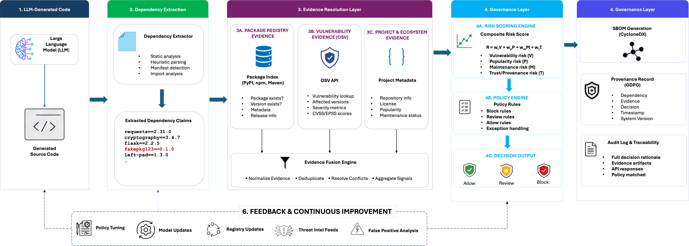

# GenDepTrace

Evidence-aware dependency governance for generative-AI-generated software.

GenDepTrace takes a generated code snippet, extracts the dependency claims it
contains, resolves each claim against PyPI or npm, checks the resolved version
against OSV, writes a CycloneDX SBOM and a provenance record, scores risk, and
issues one of three admission decisions: **ALLOW**, **REVIEW**, or **BLOCK**.

The point is to catch a hallucinated, confusable, or stale dependency *before*
it reaches a build, not after. Existing scanners start with a dependency set
that is presumed valid. This one doesn't.

---



--- 
## Table of contents

- [What's in the box](#whats-in-the-box)
- [Requirements](#requirements)
- [Install](#install)
- [HuggingFace setup](#huggingface-setup)
- [Quick start](#quick-start)
- [Configuration](#configuration)
- [Directory layout](#directory-layout)
- [How the pipeline works](#how-the-pipeline-works)
- [Running the individual stages](#running-the-individual-stages)
- [Outputs](#outputs)
- [Common issues](#common-issues)
- [Reproducing the paper](#reproducing-the-paper)
- [Design notes](#design-notes)
- [Limitations](#limitations)
- [Citation](#citation)

---

## What's in the box

- A 300-task benchmark across PyPI and npm, covering six scenarios:
    legitimate, vulnerable, hallucinated, confusable, stale, transitive.
- A deterministic synthetic generator that isolates the policy from
    generation noise.
- Wrappers for local HuggingFace models (Qwen, Llama, anything with a
    `generate()` method).
- Five matched baselines (B0–B4) plus the full pipeline (GDT).
- Sensitivity analysis and failure injection harnesses.
- Real SCA tool integration: `pip-audit`, `npm audit`, `syft`, `grype`.

---

## Requirements

### Operating system

Linux, macOS, or WSL. The pipeline shells out to `pip-audit`, `npm`,
`syft`, and `grype`, so it expects a Unix-like environment.

### Python

Python 3.10 or newer. The environment used for the reported experiments was
Python 3.11 on Ubuntu 22.04.

### Hardware

- **Synthetic runs only:** any CPU. No GPU needed.
- **LLM runs (Qwen 1.5B, Llama 8B):** GPU strongly recommended. A modern
    NVIDIA GPU with compute capability 7.5 or higher (Turing, Ampere,
    Hopper) and at least 8 GB of VRAM. CPU fallback works but is slow:
    20–60 seconds per task for Qwen, several minutes per task for Llama.
- **Disk:** roughly 30 GB free for model weights, cache, and results.

### External tools

Optional but recommended:

| Tool | Purpose | Ecosystem |
|---|---|---|
| `pip-audit` | Vulnerability scan on Python deps | PyPI |
| `npm audit` | Vulnerability scan on JS deps | npm |
| `syft` | SBOM generation baseline | Both |
| `grype` | Vulnerability scan baseline | Both |

Missing tools are recorded as `unavailable` in the output and don't fail the
pipeline.

---

## Install

### 1. Clone the repository

```bash
git clone https://github.com/jmreddy2106/gendeptrace_benchmark.git
cd gendeptrace_benchmark

### 2. Create a virtual environment

    python -m venv .venv
    source .venv/bin/activate

On macOS or Linux. On Windows under WSL, use the same commands.

### 3. Install the base Python packages

    pip install --upgrade pip
    pip install -r requirements.txt

Contents of `requirements.txt`:

    requests>=2.31.0
    pandas>=2.0.0
    scipy>=1.11.0
    numpy>=1.24.0
    PyYAML>=6.0
    huggingface-hub>=0.22.0
```

### 4. Install the LLM extras

Only needed if you plan to run generation with an actual model. Skip this if you are nly running the synthetic generator.

```bash
pip install -r requirements-llm.txt


Contents of `requirements-llm.txt`:

    torch>=2.1.0
    transformers>=4.40.0
    accelerate>=0.28.0
    sentencepiece>=0.2.0
    protobuf>=4.25.0
    bitsandbytes>=0.43.0   # optional, for 4-bit quantization

**Important for GPU users.** The default `pip install torch` pulls a
build compiled against the latest CUDA runtime. If your driver is older,
install a build that matches:

    # Check your driver version
    nvidia-smi | head -5

    # For CUDA 12.1 (driver 530+)
    pip install torch --index-url https://download.pytorch.org/whl/cu121

    # For CUDA 12.4 (driver 550+)
    pip install torch --index-url https://download.pytorch.org/whl/cu124

    # For CUDA 12.8 (driver 570+)
    pip install torch --index-url https://download.pytorch.org/whl/cu128

Verify:

    python -c "import torch; print(torch.__version__, torch.version.cuda, torch.cuda.is_available())"

Expected output (adjust for your CUDA version):

    2.11.0+cu128 12.8 True
```
If `False` prints at the end, PyTorch sees no usable GPU. See Common
issues.

### 5. Install the real SCA tools

Skip anything you don't need. Missing tools are handled gracefully.

**pip-audit:**
```bash
pip install pip-audit
```

**Node.js and npm** (for `npm audit`):
```bash
# Debian / Ubuntu
curl -fsSL https://deb.nodesource.com/setup_22.x | sudo -E bash -
sudo apt-get install -y nodejs

# RHEL / Fedora
curl -fsSL https://rpm.nodesource.com/setup_22.x | sudo bash -
sudo dnf install -y nodejs

# macOS
brew install node
```
**Syft and Grype:**
```bash
# Linux install script
curl -sSfL https://get.anchore.io/syft | sudo sh -s -- -b /usr/local/bin
curl -sSfL https://get.anchore.io/grype | sudo sh -s -- -b /usr/local/bin

# macOS
brew install syft grype

# Verify
which pip-audit npm syft grype
```

### 6. Verify the full install
```bash
python -c "import requests, pandas, scipy, numpy, yaml, torch, transformers; print('python: ok')"
which pip-audit npm syft grype || true
python -c "import torch; print('cuda:', torch.cuda.is_available())"
```
You should see `python: ok`, one path per installed tool,
and `cuda: True` if you have a working GPU.

------------------------------------------------------------------------

## HuggingFace setup

Generation with Qwen needs no authentication. Generation with Llama 3.1
requires accepting Meta's license on HuggingFace and logging in with a
token. This section walks through the full flow.

### Step 1 --- Create a HuggingFace account

If you don't have one:

https://huggingface.co/join

### Step 2 --- Create an access token

Go to https://huggingface.co/settings/tokens and create a token
with **Read** scope. Copy the token --- you'll paste it once in the next
step.

### Step 3 --- Accept the Llama license

Open the model page while logged in:

https://huggingface.co/meta-llama/Llama-3.1-8B-Instruct

Click **"Agree and access repository"** and fill in the form. Meta
reviews these manually. Approval usually takes a few minutes to a few
hours. Sometimes it takes a day.

You can check your request status at any time by revisiting the model
page. If the button now says "You have access", you're approved.

### Step 4 --- Log in on the machine where you'll run the pipeline

The old `huggingface-cli login` command is deprecated. Use `hf`:
```bash
# Install the CLI if needed
pip install -U "huggingface_hub[cli]"

# Log in
hf auth login
```
Paste the token when prompted.

Verify:
```bash
hf auth whoami
```
You should see your username.

### Step 5 --- Verify model access
```bash
python - <<'PY'
from huggingface_hub import hf_hub_download
for m in ["Qwen/Qwen2.5-1.5B-Instruct", "meta-llama/Llama-3.1-8B-Instruct"]:
    try:
        hf_hub_download(m, "config.json")
        print(f"{m}: OK")
    except Exception as e:
        print(f"{m}: {type(e).__name__}")
PY
```

Expected:
```bash
Qwen/Qwen2.5-1.5B-Instruct: OK
meta-llama/Llama-3.1-8B-Instruct: OK
```
If Llama prints `GatedRepoError`, your access request is still pending.
The pipeline will skip Llama and continue with the other runs. Rerun
once access is granted.

### Using a token via environment (for CI or headless servers)
```bash
export HF_TOKEN=hf_xxxxxxxxxxxxxxxxxxxxxxxx
```

The `transformers` library picks this up automatically.

### Non-gated alternatives

If Llama access is delayed and you want a second model now:
```bash
QWEN_MODEL=Qwen/Qwen2.5-7B-Instruct bash scripts/08_full_pipeline.sh
```

Other ungated options:

-   `Qwen/Qwen2.5-1.5B-Instruct`
-   `Qwen/Qwen2.5-7B-Instruct`
-   `Qwen/Qwen2.5-Coder-7B-Instruct`
-   `microsoft/Phi-3-mini-4k-instruct`
-   `HuggingFaceH4/zephyr-7b-beta`

------------------------------------------------------------------------

## Quick start
```bash
# Everything: synthetic + Qwen + Llama, if models are accessible
bash scripts/08_full_pipeline.sh
```
Or run only what you need:
```bash
    # Synthetic only (fast, deterministic, no GPU needed)
    SKIP_QWEN=1 SKIP_LLAMA=1 bash scripts/08_full_pipeline.sh

    # Qwen only (reuses existing synthetic if present)
    SKIP_SYNTHETIC=1 SKIP_LLAMA=1 bash scripts/08_full_pipeline.sh

    # Llama only
    SKIP_SYNTHETIC=1 SKIP_QWEN=1 bash scripts/08_full_pipeline.sh

    # Refresh analysis without regenerating anything
    SKIP_SYNTHETIC=1 SKIP_QWEN=1 SKIP_LLAMA=1 bash scripts/08_full_pipeline.sh
```
Under tmux, with timestamps in the log:
```bash
tmux new -s gendep
bash scripts/08_full_pipeline.sh 2>&1 \
    | awk '{ print strftime("[%Y-%m-%d %H:%M:%S]"), $0; fflush() }' \
    | tee logs/pipeline.log
# Ctrl-b d to detach
```

Reattach later:

```bash
tmux attach -t gendep
```
Watch progress from another shell:
```bash
tail -f logs/pipeline.log
```
------------------------------------------------------------------------

## Configuration

The pipeline reads environment variables at the top of
`scripts/08_full_pipeline.sh`. The useful ones:

  --------------------------------------------------------------------------------------
  **Variable**         **Default**                          **Purpose**
  -------------------- ------------------------------------ ----------------------------
  `SKIP_SYNTHETIC`     `0`                                  Skip the synthetic run

  `SKIP_QWEN`          `0`                                  Skip the Qwen run

  `SKIP_LLAMA`         `0`                                  Skip the Llama run

  `SKIP_REAL_TOOLS`    `0`                                  Skip pip-audit / npm audit /
                                                            syft / grype

  `SKIP_SENSITIVITY`   `0`                                  Skip sensitivity + failure
                                                            injection

  `FORCE_REBUILD`      `0`                                  Ignore existing outputs and
                                                            regenerate

  `QWEN_MODEL`         `Qwen/Qwen2.5-1.5B-Instruct`         Any HuggingFace model ID

  `LLAMA_MODEL`        `meta-llama/Llama-3.1-8B-Instruct`   Any HuggingFace model ID

  `MAX_NEW_TOKENS`     `256`                                Generation budget per task

  `TEMPERATURE`        `0.2`                                Sampling temperature

  `TOP_P`              `0.9`                                Nucleus sampling

  `FORCE_CPU`          `0`                                  Force CPU even if a GPU is
                                                            available

  `LOAD_IN_4BIT`       `0`                                  4-bit quantization for large
                                                            models
  --------------------------------------------------------------------------------------

Example: run with a smaller generation budget and no Llama:
```bash
SKIP_LLAMA=1 MAX_NEW_TOKENS=128 bash scripts/08_full_pipeline.sh
``
All defaults live in `configs/default.yaml`. The risk weights, policy
thresholds, registry endpoints, and API timeouts are all there.

------------------------------------------------------------------------

## Directory layout

    gendeptrace/
    ├── configs/
    │   └── default.yaml
    ├── data/
    │   ├── benchmark.jsonl
    │   ├── benchmark_manifest.json
    │   └── seed/
    │       ├── scenarios.yaml
    │       ├── confusable_names.yaml
    │       └── hallucinated_names.yaml
    ├── evidence_cache/            (registry + OSV cache, auto-created)
    ├── results/
    │   ├── synthetic/
    │   ├── llm_qwen/
    │   ├── llm_llama/
    │   └── comparison/
    ├── scripts/
    │   ├── 01_build_benchmark.py
    │   ├── 02_run_generation.py
    │   ├── 03_run_evaluation.py
    │   ├── 04_run_real_baselines.py
    │   ├── 05_run_sensitivity.py
    │   ├── 06_run_failure_injection.py
    │   ├── 07_analyze.py
    │   ├── 08_full_pipeline.sh
    │   └── 09_compare_runs.py
    ├── gendepbench/
    │   ├── benchmark.py
    │   ├── baselines.py
    │   ├── evaluation.py
    │   ├── extraction.py
    │   ├── generation.py
    │   ├── osv.py
    │   ├── policy.py
    │   ├── provenance.py
    │   ├── registries.py
    │   ├── risk.py
    │   ├── sbom.py
    │   ├── statistics.py
    │   ├── timing.py
    │   └── utils.py
    ├── requirements.txt
    ├── requirements-llm.txt
    ├── LICENSE
    └── README.md
```

------------------------------------------------------------------------

## How the pipeline works

Each generated program enters the extractor, which produces a set of
normalized dependency claims. Standard-library imports are filtered out before any registry lookup. Each remaining claim is resolved against the appropriate registry and queried against OSV. The resulting evidence
record feeds three downstream artifacts: a CycloneDX SBOM, a provenance
record, and a policy decision.

The evidence model separates two things that most scanners conflate:

-   **Package existence** --- is there a package with this name?
-   **Version existence** --- does the requested version of this package
    exist?

A package that doesn't exist at all is a different problem from a
package that exists at a version that doesn't. The first is blocked. The
second is routed to review. A scanner that collapses the two can't tell a slopsquatting candidate from a stale pin.

For verified packages, six normalized factors feed a weighted score:
hallucination/identity risk, vulnerability risk, transitive risk,
package-health risk, provenance risk, and unpinned-version risk. The
score maps to REVIEW or BLOCK based on two thresholds. Package identity
is a hard gate that ignores the score entirely.

------------------------------------------------------------------------

## Running the individual stages

If you want to run each stage by hand instead of using the wrapper:

# 1. Build the benchmark (verifies versions against live registries)
```bash
python scripts/01_build_benchmark.py

# 2. Generate code
python scripts/02_run_generation.py \
    --benchmark data/benchmark.jsonl \
    --outdir results/llm_qwen \
    --model Qwen/Qwen2.5-1.5B-Instruct \
    --max-new-tokens 128

# 3. Evaluate every system
for s in B0 B1 B2 B3 B4 GDT; do
    python scripts/03_run_evaluation.py \
        --benchmark data/benchmark.jsonl \
        --outdir results/llm_qwen \
        --config configs/default.yaml \
        --system "$s" \
        --timing
done

# 4. Real SCA tools
python scripts/04_run_real_baselines.py --outdir results/llm_qwen

# 5. Sensitivity and failure injection (synthetic only)
python scripts/05_run_sensitivity.py --outdir results/synthetic
python scripts/06_run_failure_injection.py --outdir results/synthetic

# 6. Aggregate
python scripts/07_analyze.py --outdir results/llm_qwen

# 7. Cross-run comparison
python scripts/09_compare_runs.py \
    --run synthetic=results/synthetic \
    --run qwen=results/llm_qwen \
    --run llama=results/llm_llama \
    --outdir results/comparison
```
------------------------------------------------------------------------

## Outputs

Each run directory contains:

  -----------------------------------------------------------------------------
  **FileContents**             
  ---------------------------- ------------------------------------------------
  `generation.jsonl`           Raw model outputs, one row per task

  `B0.jsonl` ... `GDT.jsonl`   Per-system evaluation records

  `*.timing.json`              Per-stage latency (with `--timing`)

  `experiment_summary.csv`     Per-system aggregate

  `statistical_tests.csv`      Paired Wilcoxon results

  `task_level_metrics.csv`     Per-task rows for downstream analysis

  `real_tools.jsonl`           Raw output from pip-audit / npm audit / syft /
                               grype

  `all_evaluations.jsonl`      Stacked records across all systems

  `sensitivity/`               9 weight × threshold combinations for synthetic
                               runs
  -----------------------------------------------------------------------------

The `results/comparison/` directory holds:

  ------------------------------------------------------------------------
  **FileContents**         
  ------------------------ -----------------------------------------------
  `cross_run.csv`          Scenario × system matrix across all runs

  `cross_run.json`         Same, in JSON

  `combined_metrics.csv`   Every task × system × run, long form

  `combined_wide.csv`      One row per task × system, one column per run
  ------------------------------------------------------------------------

Quick check after a run:

# How many tasks completed
```bash
for d in results/synthetic results/llm_qwen results/llm_llama; do
    [ -f "$d/generation.jsonl" ] && echo "$d: $(wc -l < $d/generation.jsonl) tasks"
done

# Summary table
cat results/synthetic/experiment_summary.csv
cat results/comparison/cross_run.csv
```

------------------------------------------------------------------------

## Common issues

### Tesla M10 / Maxwell GPUs

Modern PyTorch requires compute capability 7.5 or higher. Tesla M10,
K80, and other Maxwell-era cards are CC 5.0 and will crash with:
```bash
CUDA error: no kernel image is available for execution on the device
```

The `generation.py` loader detects this automatically and falls back to CPU. You can also force it:
```bash
FORCE_CPU=1 bash scripts/08_full_pipeline.sh
```
Check what compute capability your GPU has:
```bash
python -c "import torch; print(torch.cuda.get_device_capability(0))"
```
If it prints `(5, 0)` or `(6, 1)`, you're on Maxwell or Pascal and CPU
is your only option.

### CUDA driver too old
```bash
UserWarning: CUDA initialization: The NVIDIA driver on your system is too old
```
Your PyTorch build expects a newer driver than you have. Reinstall
PyTorch for your actual CUDA version:

```bash
pip uninstall -y torch torchvision torchaudio
pip install torch --index-url https://download.pytorch.org/whl/cu121
```
Match the `cuXXX` suffix to your driver. `nvidia-smi` shows the version
at the top right.

### Gated HuggingFace models
```bash
GatedRepoError: 403 Client Error
Cannot access gated repo for url ...
```

Either your request is still pending, or you haven't logged in on this
machine. See HuggingFace setup.

Quick diagnostic:
```bash
hf auth whoami
python -c "from huggingface_hub import hf_hub_download; hf_hub_download('meta-llama/Llama-3.1-8B-Instruct', 'config.json')"
```

### Out of memory during generation

For large models on small GPUs:
```bash
    LOAD_IN_4BIT=1 bash scripts/08_full_pipeline.sh
```
Requires `pip install bitsandbytes`. Brings an 8B model down to \~6 GB
VRAM.

For CPU runs, reduce the generation budget:

```bash
MAX_NEW_TOKENS=64 bash scripts/08_full_pipeline.sh
```

### `mkdir: cannot create directory`

The pipeline expects to run from the repository root. Check:
```bash
pwd
ls -la gendepbench/
```

If you're somewhere else, `cd` back to the repo root.

### Registry rate limits

The evidence cache stores every registry and OSV response keyed by a
hash of the request. If you hit rate limits:
```bash
rm -rf evidence_cache/
```

### The old pipeline used to overwrite runs

If you ran an earlier version of the pipeline that wrote everything to
`results/llm/`, the current script uses separate directories
(`results/llm_qwen/`, `results/llm_llama/`). Move existing output
manually:
```bash

mv results/llm results/llm_llama   # if it contains Llama output
```
------------------------------------------------------------------------

## Reproducing the paper

The pipeline is deterministic given the same benchmark and the same
model. The benchmark builder uses a fixed seed (`20260812`) and verifies every version against the live registry at build time, so the exact package set may drift as registries change. To reproduce the reported numbers:

```bash
# 1. Fresh benchmark
FORCE_REBUILD=1 bash scripts/08_full_pipeline.sh
```
Benchmark and generation records store:

-   The benchmark seed
-   Per-task ground-truth hashes
-   Registry and OSV snapshots with retrieval timestamps
-   Model IDs and decoding parameters
-   Evidence hashes for every claim

This makes it possible to distinguish a model's behavior from a registry
change from a policy decision.

### Cost of a full run

On a machine with an Ampere or Hopper GPU:
```bash
  **StageTime**                     
  --------------------------------- ------------------
  Benchmark build                   3--5 min 
  Synthetic run + evaluation        \~30 s
  Qwen 1.5B generation              5--10 min
  Qwen evaluation                   \~2 min
  Llama 8B generation               20--30 min
  Llama evaluation                  \~2 min
  Real SCA tools                    \~5 min
  Sensitivity + failure injection   \~1 min
  Comparison                        \<1 min
  **Total**                         **\~45--60 min**
```
On CPU only:
```bash
  **Stage**              **Time**
  ---------------------- -------------
  Qwen 1.5B generation   2--4 hours
  Llama 8B generation    8--12 hours
```

If you're CPU-bound, run Qwen only and skip Llama.

------------------------------------------------------------------------

## Design notes

**Why separate package and version existence.** A package that doesn't
exist is a hallucination or a slopsquatting target. A package that
exists at a version that doesn't is a stale or fabricated pin. Treating them the same would hide the distinction that matters most for remediation.

**Why a REVIEW tier.** Not every risky dependency should block a build. Version-not-found and registry-error states are uncertainty, not failure. REVIEW stops installation until a human approves or additional evidence arrives. It is not a silent allow.

**Why evidence before SBOM.** An SBOM built from unverified model output will happily record a package that doesn't exist. GenDepTrace acquires identity evidence first, then writes the SBOM from the verified set. The provenance record captures the registry and OSV evidence behind every decision.

**Why the registry-only control (B4).** It blocks the same nonexistent
packages that GenDepTrace does. The value GenDepTrace adds over B4 is
not the block count --- it's the version check, the vulnerability
evidence, the provenance record, and the risk score that sit on top of
the identity gate.

**Why per-task and per-claim metrics.** A model that writes additional
imports inflates the claim count without affecting the per-task count.
The two views answer different questions and both are reported.

------------------------------------------------------------------------

## Limitations

-   The benchmark is constructed, not sampled from real developer
    sessions.
-   Coverage is PyPI and npm only. Cargo, Maven, and Go modules are
    untested.
-   The vulnerable scenario exercises the OSV path in only a few cases
    per run. Treat vulnerability results as a case study, not a recall
    estimate.
-   The confusable scenario has 9--13 cases per run. Too few to draw
    conclusions.
-   Latency reported here is generation latency, not per-stage
    governance latency. Per-stage timing is instrumented but not yet
    analyzed.
-   No quantum or post-quantum packages in the benchmark.

------------------------------------------------------------------------

## Citation

```bash

@inproceedings{gendeptrace2026,
title = {GenDepTrace: Evidence-Aware Dependency Governance for Generative-AI-Generated Software},
author = {Danda, Jagan Mohan Reddy and IVSL, Haritha and Chejarla, Venkata Narayana and Kesavan, Murali Krishnan and Kolli, Abhinay and Mudumuntala, JohnBabu},
booktitle = {Proceedings of the International Conference on Secure Quantum Intelligence \& Trusted Systems (IC-SQITS)},
month = {Dec}
year = {2026}
}
